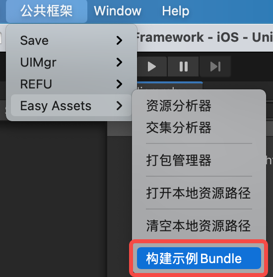
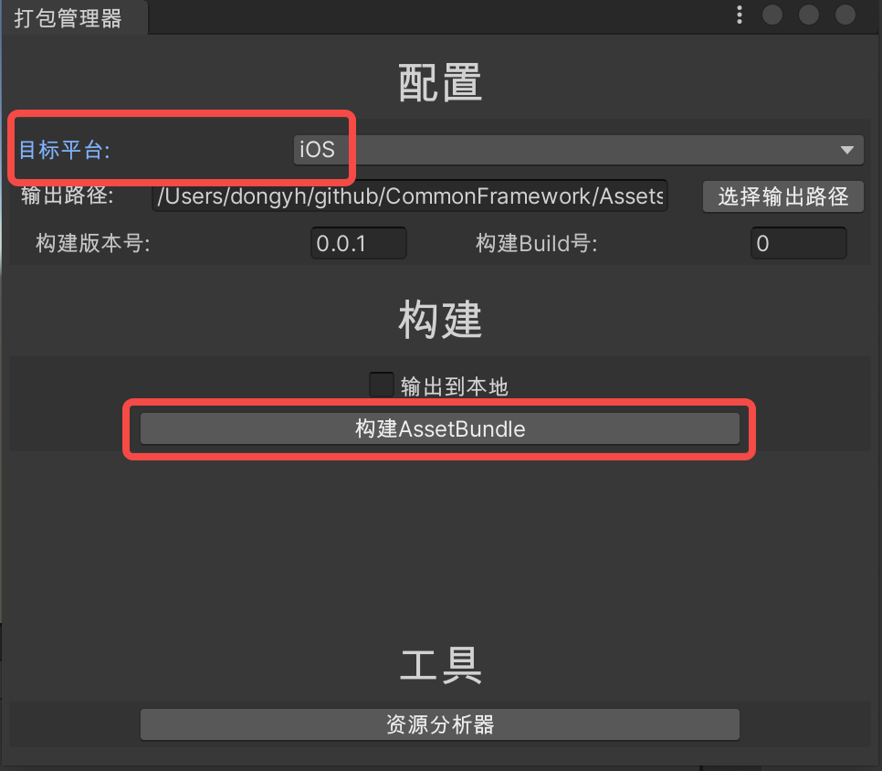

# 资源管理框架
* 拷贝 ***Assets/Framework/EasyAssets*** 除了 ***../Example*** 路径下的所有文件到 Unity 工程中。

## 1.1 入门
* 1.拷贝 ***Assets/Framework/EasyAssets/Example*** 路径下的全部文件到Unity工程中。 

* 2.点击菜单 **公共框架/Easy Assets/构建示例Bundle**。

  

* 3.选择对应的打包平台，点击**构建AssetBundle**。

  

* 4.打开场景 ***../Example/EADownload.unity***，点击运行。

## 1.2 资源分析器

## 1.3 构建AssetBundle

## 1.4 BundleCheck检查更新

## 1.5 下载设置

## 1.6 资源加载与卸载