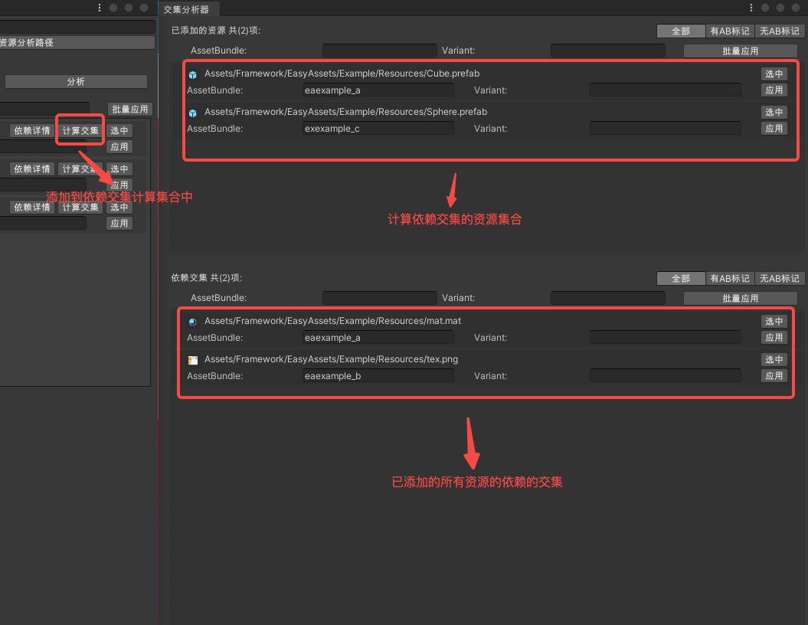
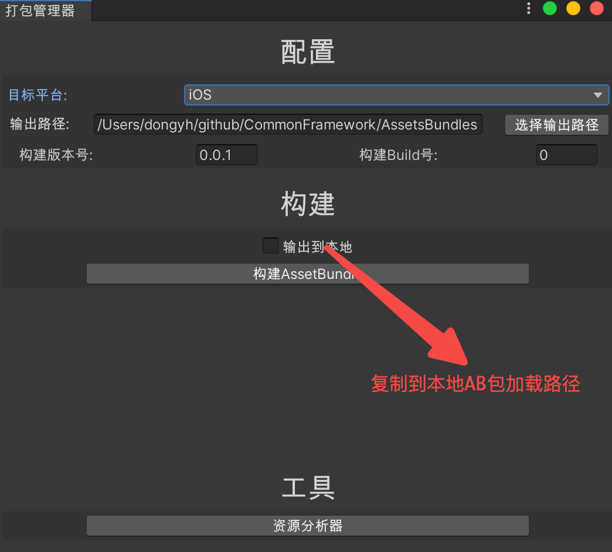
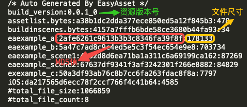
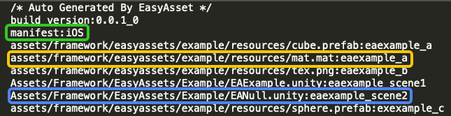
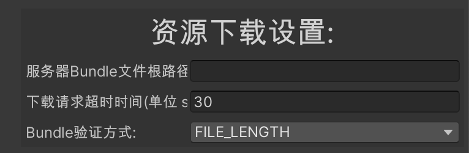
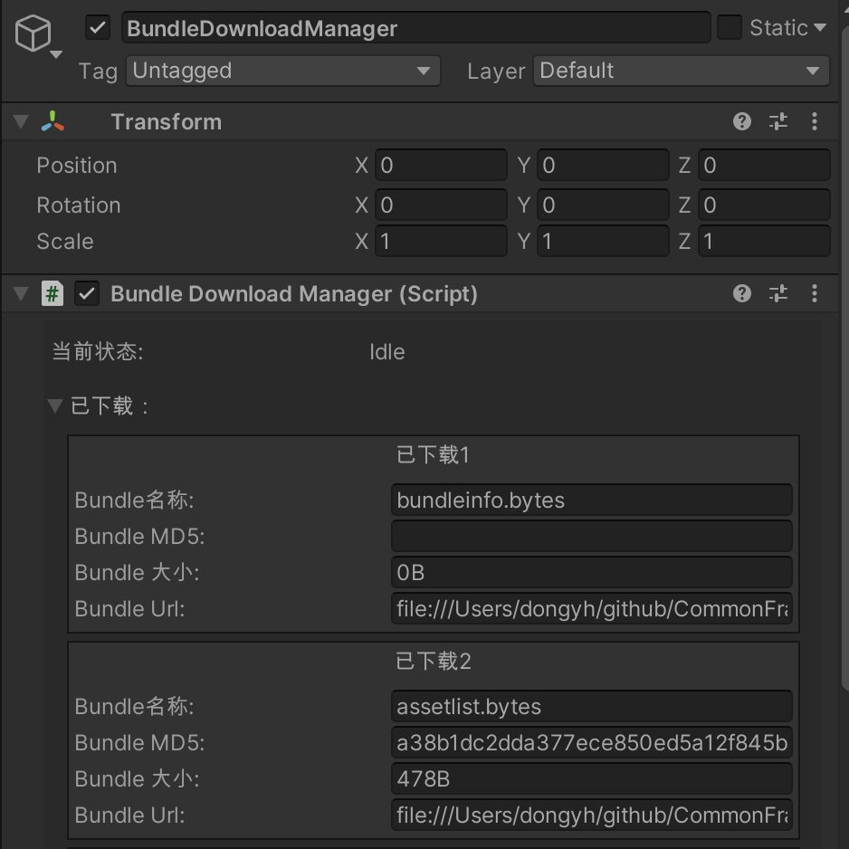
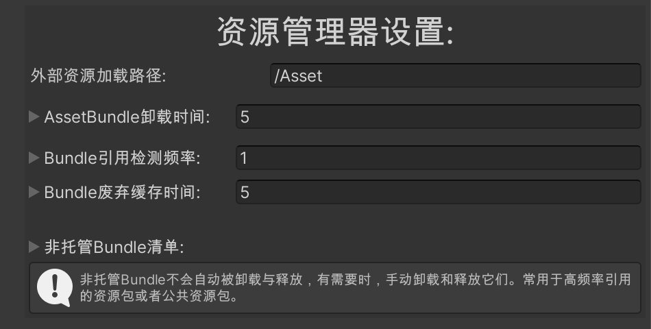

# 资源管理框架
* 拷贝 ***Assets/Framework/EasyAssets*** 除了 ***../Example*** 路径下的所有文件到 Unity 工程中。

## 1.1 入门
* 1.拷贝 ***Assets/Framework/EasyAssets/Example*** 路径下的全部文件到Unity工程中。 

* 2.点击菜单 **公共框架/Easy Assets/构建示例Bundle**。

  <div align="left">
    
  </div>

* 3.选择对应的打包平台，点击**构建AssetBundle**。

  <div align="left">
    
  </div>

* 4.打开场景 ***../Example/EADownload.unity***，点击运行。


## 1.2 资源分析
 ### 1.2.1 资源分析器
 * 1.点击菜单 **公共框架/Easy Assets/资源分析器** 打开资源分析器界面。
	<div align="left">
		
	</div>
 * 2.资源分析器界面如下图所示:
  <div align="center">
    
  </div>

---
**补充**:

   1. **过滤器**可以过滤当前分析的资源项，**批量操作**会对应过滤后的资源进行。  
   2. **反向分析器**会分析资源项都被哪些其他资源引用，多数时候，使用**正向分析器**即可。


 ### 1.2.2 交集分析器
  * 1.点击菜单 **公共框架/Easy Assets/交集分析器** 打开交集分析器界面。
  * 2.点击资源项条目中的 **计算交集** 将项目添加到计算集合中。
  * 3.**交集分析器**会列出**已添加的资源**的**最大公共依赖资源**。
 <div align="center">
    
 </div>

## 1.3 构建AssetBundle
 ### 1.3.1 打包AssetBundle
 点击菜单 **公共框架/Easy Assets/打包管理器** 打开打包管理器界面。

 <div align="left">
   
 </div>

 ### 1.3.2 特殊文件说明

 1. ***bundleinfo.bytes***
      这个文件记录了**资源版本号**以及打包出来的其余所有文件的信息。包含每个文件的**MD5**值与**文件尺寸**。文件尺寸与MD5值将被用于检测是否需要更新该文件，并在该文件下载完成后做**完整性**校验。当**客户端本地的bundleinfo**记录的文件信息与**远程服务器的bundleinfo**记录的文件信息不一样时，则会下载更新该文件。

 <div align="center">
   
 </div>

 2. ***assetlist.bytes***
 这个文件记录了**manifest文件的名称**以及所有**外部资源(打包到AssetBundle中的资源)**及其**对应的AssetBundle**。在通过资源管理器***AssetMaintainer***加载资源时，会根据传入路径判断是否为外部资源。若为外部资源，加载对应的AB包以及其依赖的AB包，然后加载资源。若是内部资源，则使用***Resources***进行加载。

  <div align="center">
   
 </div>
​      ***注意:** Unity在打包AssetBundle时，**场景资源**与**其他类型资源**需**分开**进行打包，并且场景资源的在AssetBundle中记录的路径是**区分大小写**的，其他资源是**不区分大小写（一律小写）**的。
  3. ***buildinscenes.bytes***
这个文件记录了**Build Settings**中添加的**场景**及其**是否Active**。在使用***AssetMaintainer***加载场景时，用于判断该场景是否是外部场景资源，若是外部场景资源，则需加载其依赖资源的AssetBundle。


## 1.4 BundleCheck检查更新
 ### 1.4.1 资源下载设置
 * 配置文件路径 **Assets/Framework//EasyAssets/Resources/EasyAssetsConfig.asset**。 
 <div align="left">
    
 </div>

|配置|说明|
|---|---|
|服务器Bundle文件跟路径|设置远程AssetBundle文件根目录。|
|下载请求超时时间|设置下载请求的超时时间，下载进度停止超过超时时间后，会判定为超时。|
| Bundle验证方式|下载完成后，验证完整性的方式。分为MD5验证和文件尺寸验证两种方式。|

 ### 1.4.2 检查资源更新
 * 调用如下接口检查是否需要更新，如需更新，会自动开始下载。
 ```c#
    public class BundleCheck : Singleton<BundleCheck>
    {
        /// <summary>
        /// 从远程服务器检测是否需要更新
        /// </summary>
        /// <param name="onCheckFinish">检测结果回调</param>
        /// <param name="onUpdateFinish">更新完成回调</param>
        /// <param name="onDownloadProgress">下载进度回调</param>
        public static void CheckUpdateFromRemote(Action<BundleCheckResult> onCheckFinish,
        Action onUpdateFinish,Action<float> onDownloadProgress = null)
     }
 ```
* Action<BundleCheckResult> onCheckFinish 检查结果回调，需在检查失败时进行处理。
* Action onUpdateFinish 更新完成回调。
* Action<float> onDownloadProgress 下载进度回调，可以处理下载进度显示。
---
* 调用如下接口检查 **指定版本的资源** 是否需要更新，如需跨资源版本进行热更新，可以使用此接口。
 ```c#
    public class BundleCheck : Singleton<BundleCheck>
    {
        /// <summary>
        /// 从远程服务器检测是否需要更新
        /// </summary>
        /// <param name="version">远程版本号</param>
        /// <param name="onCheckFinish">检测结果回调</param>
        /// <param name="onUpdateFinish">更新完成回调</param>
        /// <param name="onDownloadProgress">下载进度回调</param
        public static void CheckUpdateFromRemote(
            string version,
            Action<BundleCheckResult> onCheckFinish,
            Action onUpdateFinish,
            Action<float> onDownloadProgress = null)
     }
 ```

### 1.4.3 验证本地资源文件
* 调用如下接口验证本地资源文件完整性
```c#
    public class BundleCheck : Singleton<BundleCheck>
    {
        /// <summary>
        /// 验证本地文件完整性
        /// </summary>
        /// <returns></returns>
        public static bool VerifyIntegrity()
    }
```
* 当**检查更新失败**时，可以调用此接口来验证本地资源文件是否已经完整，若完整，则可以进入游戏，或者根据业务需要另作处理。

### 1.4.4 下载失败处理
* 调用如下接口传入**委托**处理文件下载失败的情况。
```c#
    public class BundleCheck : Singleton<BundleCheck>
    {
	      /// <summary>
        /// 设置Bundle文件下载失败回调方法
        /// </summary>
        /// <param name="onDownloadError"></param>
        public static void SetDownloadBundleErrorHandler(Action<BundleDownloadRequest> onDownloadError)
    }
```

* 调用如下接口**重新下载**当前文件。
```c#
    public class BundleCheck : Singleton<BundleCheck>
    {
        /// <summary>
    		/// 重置当前下载请求状态，可以重新开始下载。
    		/// </summary>
    		public static bool ResetCurrentRequest()
    }
```

 ### 1.4.5 下载信息
 * 调用***BundleDownloadManager(单例)***的字段获取下载相关的信息
|接口|说明|
|---|---|
|currentStep|当前下载的第N个文件|
|totalStep|需下载的全部文件数量|
|downloadSpeed|当前下载速度|
|downloadProgress|当前下载进度|
|isDownloading|是否下载中|
|currentStatus|当前下载状态|
|totalbytes|需下载的文件总尺寸|
|downloadbytes|当前已下载的文件尺寸|

* 可以在 **Unity Editor** 中实时查看**BundleDownloadManager(GameObject)**的**Inspector**面板查看下载信息及下载记录。
 <div align="left">
    
 </div>

 ### 1.4.6 热更新解决方案建议
 * 检查资源清单的路径为 域名/前缀/资源版本号/平台/bundleinfo.bytes
 例如: ***https://company.xxxxgame.com/product/0.0.1_0/Android/bundleinfo.bytes***
    其中 ***https://company.xxxxgame.com/product*** 这部分为远程服务器Url根目录，根据项目的实际需求向运维同学获取。
    后一部分 ***0.0.1_0/Android/bundleinfo.bytes*** 会根据打包时的配置自动进行拼接，不同版本号的资源在服务器上需按照不同的路径进行存储以及分发。

 * 若不需要跨版本号进行更新，只需调用***BundleCheck.CheckUpdateFromRemote(onCheckResult,onUpdateFinish)***检查更新。该方法会将本地的bundoinfo与服务器上同版本号路径下的bundleinfo进行对比。当资源发生变动时，不修改资源本号重新打包资源，然后替换到资源服务器上，即可实现资源的热更新。

 * 若要跨版本号进行更新时，需要**手动传入**想要进行对比的版本号(**通常需要主动从逻辑服务器获取当前版本对应的资源版本号**)，然后会下载服务器对应该版本号的路径下的bundleinfo进行对比。当前App版本对应哪一资源版本号，需要**自行实现**。
---

## 1.5 资源加载与卸载
 ### 1.5.1 资源管理器设置
  * 配置文件路径 **Assets/Framework//EasyAssets/Resources/EasyAssetsConfig.asset**。 
 <div align="left">
    
 </div>

|配置|说明|
|---|---|
|外部资源加载路径|外部资源存储与加载路径，相对于当前平台沙盒路径。完整路径为***Application.persistentDataPath+"/Asset"***|
|AssetBundle卸载时间|已加载的 **AssetBundle** 对象的存活时间，已经加载并且使用过的**AssetBundle** 对象会在N秒后自动卸载。|
| Bundle引用检测频率 |**Bundle引用数量**的检测间隔时间，每间隔N秒检测一次。|
|Bundle废弃缓存时间|当释放**Bundle对象**时，该对象会进入**废弃缓冲池**，并在N秒后**真正**释放并销毁。|
|非托管Bundle清单|非托管Bundle不会**自动**被卸载与释放，有需要时，**手动**卸载和释放它们。常用于**高频率引用**的资源包或者**公共**资源包。使用时填入AssetBundle的**名称**。|

### 1.5.2 资源加载
* 使用资源管理器***AssetsMaintainer***进行资源的加载。使用前需初始化资源管理器。
* 加载**外部资源**时，需传递对该资源的引用对象。加载**内部资源**时，不需要维护引用(传null即可)。
* 使用如下接口初始化资源管理器
```c#
	public class AssetMaintainer : MonoSingleton<AssetMaintainer>
	{
	    public static bool Init()
	}
```
* 使用如下接口同步加载资源，通过这种方式加载资源时，需传递引用该资源的对象
```c#
	public class AssetMaintainer : MonoSingleton<AssetMaintainer>
	{
	  /// <summary>
    /// 同步加载资源
    /// </summary>
    /// <typeparam name="T">资源类型</typeparam>
    /// <param name="assetPath">资源路径</param>
    /// <param name="referenceObject">引用对象</param>
    /// <returns></returns>
    public static T LoadAsset<T>(string assetPath, object referenceObject)
        where T : UnityEngine.Object
	}
```

* 使用如下接口同步加载GameObject，此方法会返回原Prefab的一个新实例对象。
```c#
	public class AssetMaintainer : MonoSingleton<AssetMaintainer>
	{
	  /// <summary>
    /// 同步加载GameObject
    /// </summary>
    /// <param name="assetPath">资源路径</param>
    /// <param name="parent"></param>
    /// <returns></returns>
    public static GameObject LoadGameobject(string assetPath, Transform parent = null)
	}
```

* 使用如下接口异步加载资源，通过这种方式加载资源时，需传递引用该资源的对象
```c#
	public class AssetMaintainer : MonoSingleton<AssetMaintainer>
	{
	    public static void LoadAssetAsync<T>(string assetPath, object refrenceObject, Action<T> onFinish)
        where T : UnityEngine.Object
	}
```
* 使用如下接口异步加载GameObject，此方法会返回原Prefab的一个新实例对象。
```c#
	public class AssetMaintainer : MonoSingleton<AssetMaintainer>
	{
      public static void LoadGameobjectAsync(string assetPath, Action<GameObject> onFinish, Transform parent = null)
	}
```

### 1.5.3 资源引用维护
* 用上面的接口加载外部资源时，需传递引用该资源的对象。资源管理器会对包含该资源的资源包进行引用维护，当该资源包没有引用时，会在一定时间后卸载该资源(AssetBundle对象会在资源加载后自动卸载)。
* 有些时候，当需要预先加载资源，但又不需立即使用的时候。调用如下接口可以手动添加对某资源的引用。
```c#
	public class AssetMaintainer : MonoSingleton<AssetMaintainer>
	{
	  /// <summary>
    /// 记录资源的引用
    /// </summary>
    /// <param name="asset"></param>
    /// <param name="refrence"></param>
    public static void TrackingAsset(object asset, object refrence)
	}
```
* 加载了**外部资源**却未正确设置其引用，可能会导致该资源被提前卸载。请确保在必要的时候添加对已加载资源的引用。
* 加载**内部资源**时，**不需要维护**其引用。
---
**示例:***
	当需要实例化一个Prefab时,可以使用以下两种方式:

**一. 方式1**

```c#
	public class EAExample : MonoBehaviour
	{
		private void Awake()
    {//加载外部GameObject---方式1
      
			var go = AssetMaintainer.LoadGameobject("assets/framework/easyassets/example/resources/cube.prefab");
			go.name = "External Cube 1.1";
    	/*使用这种方式加载的GameObject不需设置引用，资源管理器会自动将新实例化的GameObject添加引用*/
    }
	}
```

**二. 方式2**

```c#
	public class EAExample : MonoBehaviour
	{//加载外部GameObject---方式2
    private void Awake()
    { 
    	//加载Prefab资源，保存引用
			var temp = AssetMaintainer.LoadAsset<GameObject>("assets/framework/easyassets"
			+"/example/resources/cube.prefab", this);
			var new_go = Instantiate(temp);
    	//实例化GameObject
			new_go.name = "External Cube 2";
    	//添加对该资源的引用
			AssetMaintainer.TrackingAsset(temp, new_go);
    }
	}
```

### 1.5.4 资源卸载

* 当使用**非托管Bundle**时，需手动卸载和释放Bundle对象。

* 可以使用如下方法卸载Bundle的**AssetBundle**对象，该方法不会释放已加载的资源

```c#
	public class AssetMaintainer : MonoSingleton<AssetMaintainer>
	{
	  /// <summary>
    /// 手动卸载Bundle对象，调用该方法会卸载Asset Bundle对象，不会释放已加载的资源。
    /// </summary>
    /// <param name="bundleName"></param>
    public static void UnloadBundle(string bundleName)
	}
```

* 可以使用如何方法释放Bundle对象，该方法会**卸载AssetBundle**对象，并**释放已加载的所有资源**。
```c#
	public class AssetMaintainer : MonoSingleton<AssetMaintainer>
	{
	  /// <summary>
    /// 手动释放Bundle对象,调用该方法会卸载Asset Bundle对象，并释放所有已加载的资源。
    /// (仅对非托管的Bundle对象有效)
    /// </summary>
    /// <param name="bundleName"></param>
    public static void ReleaseBundle(string bundleName)
	}
```

* ***AssetsMaintainer***加载内部资源时，会使用***Resources***进行加载。可以使用***Resources.UnloadUnusedAssets()***卸载未被引用的资源。
* 若要**单独卸载某个已加载资源(不建议这样做)**，而不是卸载整个Bundle对象时。可以使用***Resources.UnloadAsset(Object assetToUnload)***。